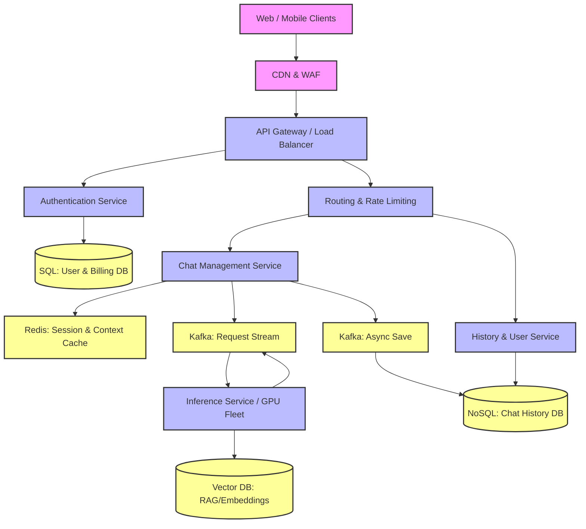

# ChatGPT-Style Conversational AI Architecture

## 1. Architecture Overview
This solution details a highly scalable, low-latency, and resilient cloud-agnostic microservices architecture for a conversational Large Language Model (LLM) application similar to ChatGPT. The design prioritizes real-time streaming of text, robust session management, and efficient utilization of expensive GPU compute resources. Requests flow from clients through a Content Delivery Network (CDN) and Web Application Firewall (WAF) to an API Gateway. The core relies on an asynchronous event-driven pattern using message brokers to manage high-throughput LLM inference, while fast key-value stores manage conversational context. 

## 2. Architecture Diagram

## 3. Well-Architected Framework Analysis

### Operational Excellence
*   **Infrastructure as Code (IaC):** All microservices and infrastructure components are deployed using tools like Terraform or Pulumi, ensuring repeatable and consistent environments.
*   **Observability:** Distributed tracing (e.g. OpenTelemetry) is implemented across the API Gateway, Chat Service, and Inference Service to pinpoint latency bottlenecks. Centralized logging and metrics (Prometheus/Grafana) monitor GPU utilization, token generation rates, and API error rates.
*   **Automated Deployments:** CI/CD pipelines utilize canary deployments for the Inference Service, allowing gradual rollout of new model weights to ensure response quality before full deployment.

### Security
*   **Edge Protection:** A WAF mitigates DDoS attacks, SQL injection, and cross-site scripting (XSS).
*   **Authentication & Authorization:** OAuth2.0/OIDC protocols are used for user identity. JWT (JSON Web Tokens) authorize inter-service communication.
*   **Data Privacy:** Personally Identifiable Information (PII) is scrubbed or anonymized before conversational data is logged for model training. All data is encrypted at rest (AES-256) and in transit (TLS 1.3).
*   **Input Sanitization:** Prompt injection defenses and toxicity filters are deployed at the API Gateway and Inference boundaries.

### Reliability
*   **Decoupled Components:** Kafka acts as a buffer between the fast Chat Service and the slower, resource-intensive GPU Inference Fleet. If inference slows down, messages queue safely without dropping user requests.
*   **Redundancy:** All stateless microservices are deployed across multiple Availability Zones (AZs). Databases use active-passive replication for automatic failover.
*   **Circuit Breakers:** Implemented on the Chat Service to degrade gracefully (e.g. returning a "System at capacity" message) if the Inference Service exceeds latency thresholds.

### Performance Efficiency
*   **Server-Sent Events (SSE) / WebSockets:** Used to stream tokens back to the client in real-time, drastically reducing perceived latency.
*   **Context Caching:** Redis caches recent conversation history. Instead of querying the database for every new message, the Chat Service instantly pulls context from RAM to build the LLM prompt.
*   **Inference Optimization:** Continuous Batching and KV Caching are utilized on the GPU nodes to maximize throughput and minimize the time-to-first-token (TTFT).

### Cost Optimization
*   **Autoscaling compute:** CPU-based microservices use horizontal pod autoscaling based on memory/CPU. GPU nodes use custom metrics (e.g. queue depth in Kafka) to scale up only when inference demand spikes.
*   **Spot Instances:** Non-critical background tasks (like bulk data embedding or model fine-tuning) utilize preemptible/spot cloud instances to save up to 70% on compute costs.
*   **Storage Tiers:** Older chat histories are automatically migrated from hot NoSQL storage to cheaper object storage (e.g. S3/GCS) after 30 days of inactivity.

### Sustainability
*   **Model Quantization:** Serving models using INT8 or FP8 precision rather than FP16 reduces the memory footprint and the electrical power required per inference operation.
*   **Region Selection:** Where data sovereignty laws permit, GPU clusters are provisioned in data centers powered by high percentages of renewable energy.
*   **Efficient Hardware:** Utilizing the latest generation of specialized AI accelerators (like TPUs or modern GPUs) which offer better performance-per-watt ratios compared to older hardware.

## 4. Technical Glossary

*   **API Gateway:** A server that acts as an API front-end, receiving API requests, enforcing throttling and security policies, passing requests to the back-end service, and then passing the response back to the requester.
*   **Availability Zone (AZ):** Isolated locations within data center regions from which public cloud services originate and operate.
*   **CI/CD:** Continuous Integration and Continuous Deployment; practices for automating the building, testing, and deployment of code.
*   **Continuous Batching:** An LLM inference optimization technique that groups incoming requests dynamically at the token level, rather than waiting for static batches, maximizing GPU utilization.
*   **Inference:** The process of running live data through a trained AI model to make a prediction or generate an output (in this case, generating text).
*   **Kafka:** A distributed event streaming platform used for high-performance data pipelines, streaming analytics, data integration, and mission-critical applications.
*   **KV Caching (Key-Value Caching):** In LLMs, storing the intermediate attention keys and values of previous tokens so they do not need to be recomputed for every new token generated.
*   **OIDC (OpenID Connect):** An identity layer on top of the OAuth 2.0 protocol, allowing clients to verify the identity of the end-user based on the authentication performed by an authorization server.
*   **RAG (Retrieval-Augmented Generation):** An AI framework that retrieves facts from an external knowledge base to ground large language models on the most accurate, up-to-date information.
*   **SSE (Server-Sent Events):** A standard allowing a web page to get updates from a server via an HTTP connection, ideal for unidirectional streaming like receiving generated text.
*   **Vector DB:** A database designed to store, manage, and search embedding vectors (mathematical representations of data), crucial for semantic search and RAG architectures.
*   **WAF (Web Application Firewall):** A specific form of application firewall that filters, monitors, and blocks HTTP traffic to and from a web service.
