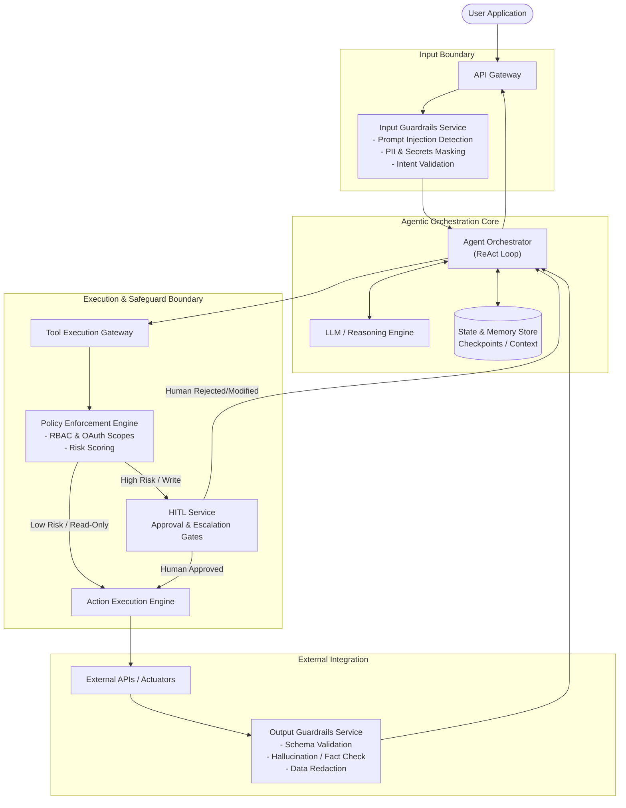

## 1. Architecture Overview

This architecture defines a secure, cloud-agnostic microservices framework for an AI Agentic System designed to take autonomous or semi-autonomous actions on behalf of a user. Delegating execution authority to an AI requires shifting from traditional static guardrails to dynamic, runtime enforcement policies. 

The solution is built around an **Orchestration Loop (ReAct)** flanked by strict isolation boundaries. It implements a multi-layered defense-in-depth strategy: **Input Guardrails** to sanitize user intent, **Execution Guardrails** acting as a Zero-Trust gateway for tool invocation, and **Output Guardrails** to validate the integrity of system responses. Crucially, it incorporates a **Stateful Human-in-the-Loop (HITL) Checkpoint** mechanism, ensuring that high-risk or irreversible actions (e.g., financial transactions, data deletion) are paused, serialized to a database, and held for explicit human authorization before execution. Furthermore, the system relies on strict identity propagation, ensuring the AI only acts within the exact authorized scope of the requesting user.

## 2. Architecture Diagram

## 3. Well-Architected Framework Analysis

### Operational Excellence
* **Policy-as-Code:** Guardrail rules, risk scoring thresholds, and tool access permissions are maintained in version control alongside the application code. This allows for automated testing of safety policies in CI/CD pipelines before deploying to production.
* **Comprehensive Observability:** Every step of the agent loop is logged with high fidelity. Traces include the raw prompt, the LLM reasoning path (thoughts), tool selection, passed parameters, and the applied policy decisions. This is critical for auditing "why" an agent took a specific action.
* **Incident Response Playbooks:** Distinct alerts are configured for system failures (e.g., LLM timeouts) versus safety violations (e.g., frequent prompt injection attempts or repeated rejected HITL requests).

### Security
* **Identity Propagation & Least Privilege:** The AI does not use a monolithic "superuser" service account. Instead, user authentication tokens (e.g., OAuth 2.0 JWTs) are passed through to the Tool Gateway. The agent can only execute tools and access data explicitly authorized for the requesting user.
* **Layered Guardrails:** * *Input:* Prevents malicious actors from hijacking the agent's instructions (Prompt Injection/Jailbreaks).
  * *Execution:* Validates tool arguments natively before execution (e.g., ensuring a requested monetary transfer does not exceed a hardcoded maximum limit).
* **Deterministic Enforcement:** Security controls (Policy Engine) live *outside* the LLM. The system never relies on the LLM to self-police its own actions.

### Reliability
* **State Persistence for HITL:** Agent workflows can span extended periods. When a high-risk action hits the HITL service, the orchestrator serializes the current state (memory, tool results, active plan) to a durable datastore. This pause-and-resume architecture ensures that workflow context survives server restarts or network disruptions while waiting for human approval.
* **Graceful Degradation:** If external APIs fail or the Output Guardrails detect severe hallucinations, the orchestration loop is programmed to catch the exception, formulate a fallback plan, or explicitly transfer control back to the user with a clear explanation of the failure.

### Performance Efficiency
* **Guardrail Segregation:** Input and Execution guardrails rely on fast, deterministic tools (regex, lightweight classifiers, rules engines) rather than routing everything through latency-heavy LLMs.
* **Semantic Caching:** Frequently asked questions or identical read-only tool invocations are cached at the boundary to reduce API calls and LLM token generation, drastically lowering response times.
* **Asynchronous Checkpoints:** The HITL approval process is decoupled. The agent loop releases compute resources while waiting for human intervention, preventing thread exhaustion.

### Cost Optimization
* **Tiered LLM Routing:** Small, fast, and cheaper models (or localized ML classifiers) are utilized for intent detection and input/output guardrails. Large, complex, and expensive frontier models are reserved exclusively for the core reasoning and complex planning phases.
* **Token Pruning:** The Memory Store employs summarization and token-pruning algorithms to prevent the context window from bloating over long multi-step workflows, directly reducing per-inference token costs.

### Sustainability
* **Compute Efficiency:** By terminating unsafe, malformed, or unauthorized requests at the Input Guardrail layer, the system prevents wasteful execution of resource-intensive LLM inferences and downstream external API calls.
* **Right-Sizing Infrastructure:** The event-driven, microservices nature of the execution and HITL layers allows the infrastructure to scale down to zero during idle periods, minimizing idle energy consumption.

## 4. Technical Glossary

* **ReAct Loop (Reasoning and Acting):** An iterative architectural pattern where an LLM cycles between generating a reasoning trace (thinking about what to do next) and executing an action (calling a tool), repeating until the objective is achieved.
* **Human-in-the-Loop (HITL):** A system design pattern that requires human interaction at critical decision points. In this architecture, it acts as an approval gate where a workflow pauses execution to seek explicit authorization from a human before proceeding with high-risk actions.
* **Agentic Orchestrator:** The central control plane microservice that manages the state of the agent, controls the prompt construction, interfaces with the LLM, and dictates the flow of execution.
* **Policy-as-Code:** The practice of defining security, compliance, and operational rules in machine-readable definition files, allowing guardrails to be tested, versioned, and deployed systematically.
* **Zero-Trust Architecture:** A security framework requiring all users, whether in or outside the organization's network, to be authenticated, authorized, and continuously validated. In this context, the Tool Gateway does not implicitly trust the LLM's requests.
* **Semantic Caching:** A method of storing previously generated LLM responses and retrieving them based on the *meaning* (vector similarity) of a new prompt, rather than an exact keyword match.
* **Prompt Injection:** A cybersecurity vulnerability where a user deliberately inputs malicious text designed to manipulate the LLM into ignoring its system instructions and executing unintended actions.
* **PII Masking:** The automated process of detecting and obscuring Personally Identifiable Information (like social security numbers or credit cards) from text before it is sent to external LLM providers or logged in observability platforms.
* **Actuators:** The specific tools, APIs, or scripts that translate the agent's digital decisions into actual changes in external systems (e.g., an API endpoint that updates a database or sends an email).
