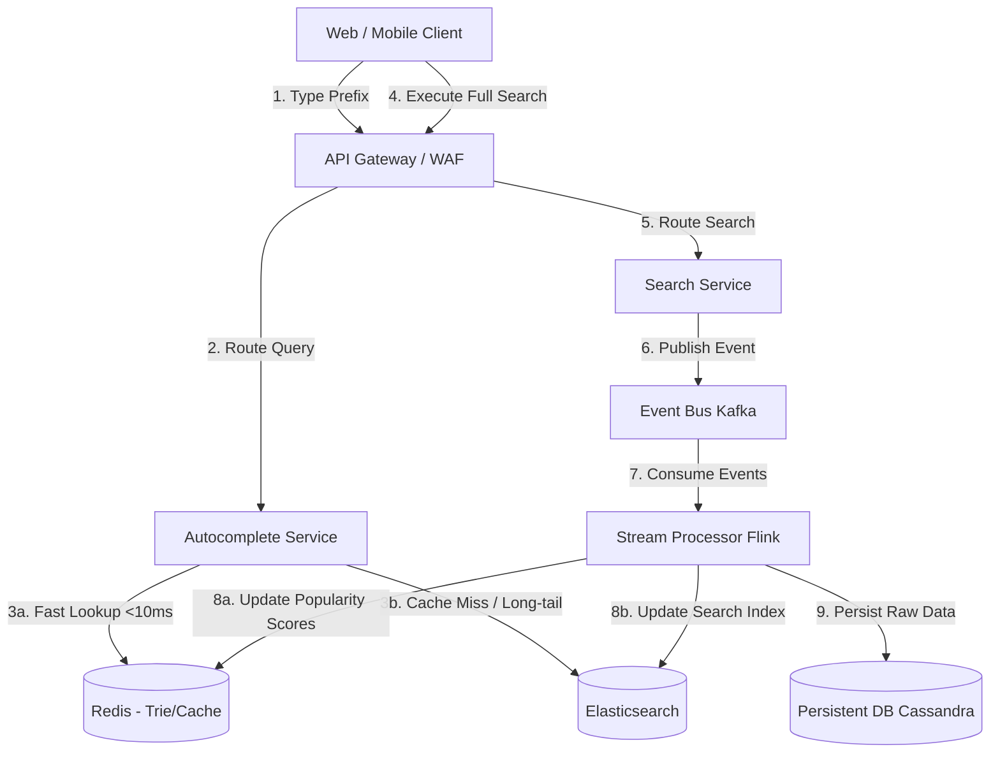

# Typeahead/Autocomplete Search System Architecture 
# 1. Architecture Overview

The proposed solution for a scalable, low-latency Typeahead/Autocomplete search system relies on a cloud-agnostic microservices architecture optimized for read-heavy workloads. To achieve sub-50ms response times, the system utilizes an in-memory data store (Redis) leveraging Trie data structures or Sorted Sets to serve prefix matches instantly. 

A decoupled asynchronous ingestion pipeline processes actual user search queries via an event broker (Kafka) and a stream processor (Flink/Spark). This pipeline aggregates query frequencies and updates the autocomplete cache in near real-time, ensuring that the most relevant and popular suggestions are surfaced. A secondary search engine (Elasticsearch) handles cache misses and long-tail prefix queries.

# 2. Architecture Diagram

# 3. Well-Architected Framework Analysis

* **Operational Excellence:**
    * **Observability:** Implement distributed tracing and centralized logging. Monitor critical metrics such as cache hit/miss ratios, p99 latency for the Autocomplete Service, and stream processing lag.
    * **Automation:** Utilize CI/CD pipelines for immutable container deployments (e.g. Kubernetes) and Infrastructure as Code (Terraform) to ensure consistent environment provisioning.

* **Security:**
    * **Perimeter Protection:** Deploy a Web Application Firewall (WAF) at the API Gateway to prevent malicious bots, rate-limit excessive requests, and mitigate DDoS attacks.
    * **Data Protection:** Enforce TLS in transit for all microservice communications and encrypt at rest for persistent databases. Implement strict IAM roles and least-privilege access between services.

* **Reliability:**
    * **Fault Tolerance:** Deploy microservices across multiple Availability Zones (AZs). Use Circuit Breakers in the Autocomplete Service to fallback gracefully (e.g. returning cached static popular searches) if Redis or Elasticsearch is degraded.
    * **Data Durability:** While Redis acts as an ephemeral cache, the stream processor guarantees persistence to a highly available NoSQL database (like Cassandra) to rebuild the cache in case of catastrophic failure.

* **Performance Efficiency:**
    * **Latency Optimization:** Push autocomplete logic as close to the user as possible. The client should implement debouncing (e.g. waiting 150ms after the last keystroke) before calling the API. Redis handles the heavy lifting via optimized Trie queries or Sorted Sets.
    * **Scalability:** The read-heavy Autocomplete Service and Redis clusters are decoupled from the write-heavy event ingestion pipeline, allowing both to scale horizontally independent of one another.

* **Cost Optimization:**
    * **Tiered Storage:** Only store the top `N` most popular prefixes in the expensive, memory-bound Redis cache. Route long-tail, infrequent queries to the more cost-effective disk-backed Elasticsearch cluster.
    * **Right-Sizing:** Utilize horizontal pod autoscaling (HPA) to scale the Autocomplete Service dynamically based on CPU/Memory utilization during peak and off-peak hours.

* **Sustainability:**
    * **Compute Efficiency:** The use of Trie data structures drastically reduces the CPU cycles required for string matching compared to brute-force database lookups.
    * **Reduced Network Payload:** By debouncing at the client side and sending minimal JSON payloads, network bandwidth overhead and subsequent energy consumption are significantly lowered.

# 4. Technical Glossary

* **Typeahead / Autocomplete:** A user interface feature that predicts the rest of a word or phrase a user is typing, providing a dropdown of suggestions to speed up data entry or search.
* **Trie (Prefix Tree):** A tree-like data structure that proves highly efficient for string searching and prefix matching operations.
* **API Gateway:** A server that acts as an API front-end, receiving API requests, enforcing throttling and security policies, passing requests to the back-end service, and then passing the response back to the requester.
* **Redis:** An open-source, in-memory data structure store used as a database, cache, and message broker, known for sub-millisecond response times.
* **Elasticsearch:** A distributed, RESTful search and analytics engine capable of addressing a growing number of use cases, commonly used for complex full-text search.
* **Kafka:** A distributed event streaming platform used for high-performance data pipelines, streaming analytics, and data integration.
* **Flink / Spark (Stream Processors):** Frameworks for stateful computations over unbounded and bounded data streams, used here to calculate trending search terms in real-time.
* **Debouncing:** A programming practice used to ensure that time-consuming tasks do not fire so often, making them run only after a specific amount of time has passed without the event being triggered.
* **WAF (Web Application Firewall):** A firewall that monitors, filters, and blocks HTTP traffic to and from a web application to protect against exploits.
* **Circuit Breaker:** A design pattern used to detect failures and encapsulate the logic of preventing a failure from constantly recurring, during maintenance, or temporary external system outages.
