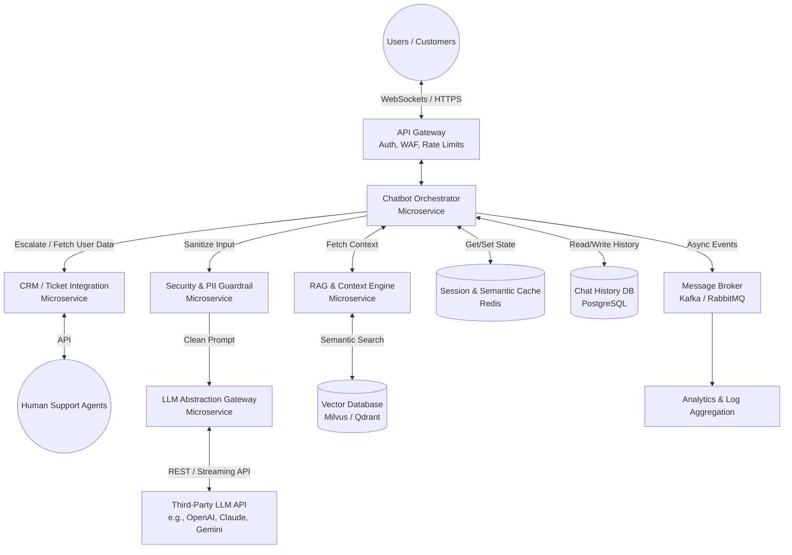

# Customer-Support Chatbot Integration Architecture

## 1. Architecture Overview
This solution proposes a cloud-agnostic, event-driven microservices architecture to power an intelligent customer-support chatbot. By integrating a third-party Large Language Model (LLM) with internal enterprise systems, the architecture ensures context-aware, highly personalized customer interactions. The design utilizes Retrieval-Augmented Generation (RAG) to query internal knowledge bases safely, features an LLM abstraction layer for multi-model redundancy, and employs semantic caching to reduce latency and API costs. A dedicated security guardrail intercepts all outbound traffic to sanitize Personally Identifiable Information (PII) before it reaches the third-party LLM provider.

## 2. Architecture Diagram

## 3. Well-Architected Framework Analysis

### Operational Excellence
* **Decoupled Orchestration:** The microservices approach enables independent deployment, scaling, and updating of the chatbot logic, context retrieval, and LLM communication components.
* **Observability & Distributed Tracing:** All requests passing through the API Gateway, Chatbot Service, and LLM Gateway are tagged with unique correlation IDs. This allows end-to-end tracing (e.g., via OpenTelemetry) to monitor latency spikes and debug conversational flow issues.
* **Prompt Versioning:** Prompts, system instructions, and RAG configurations are treated as code. They are maintained in source control and deployed through CI/CD pipelines to ensure consistent versioning, testing, and rapid rollback capabilities.

### Security
* **Data Anonymization (PII Guardrails):** The `Security & PII Guardrail` service intercepts all outbound payloads, actively redacting Personally Identifiable Information (PII) before the prompt is transmitted to the external third-party LLM platform.
* **Authentication & Authorization:** The API Gateway validates user session tokens (JWT) and enforces rate limiting to prevent API abuse or Distributed Denial of Service (DDoS) attacks.
* **Secret Management:** External LLM API keys, vector database credentials, and CRM tokens are never hardcoded. They are securely injected into the microservices at runtime using a centralized secrets manager (e.g., HashiCorp Vault).

### Reliability
* **LLM Abstraction & Circuit Breaking:** The `LLM Abstraction Gateway` prevents vendor lock-in and acts as a circuit breaker. If the primary LLM API experiences downtime or severe rate limiting, the gateway automatically reroutes traffic to a secondary model or provider.
* **Graceful Degradation:** If the LLMs are entirely unreachable, the orchestrator falls back to a deterministic, rule-based menu flow or instantly escalates the conversation to a human agent via the CRM service.
* **State Persistence:** User sessions and conversational histories are stored in a highly available relational database (PostgreSQL) and temporarily cached (Redis), ensuring that container restarts do not result in dropped customer conversations.

### Performance Efficiency
* **Streaming Responses:** The architecture leverages Server-Sent Events (SSE) or WebSockets from the LLM Gateway down to the client. This provides a low-latency, real-time "typing" experience for the user instead of waiting for the entire generation to complete.
* **Semantic Caching:** Before querying the expensive third-party LLM, the system checks the Redis semantic cache. If a conceptually identical question was recently answered, the system instantly returns the cached response, bypassing the LLM entirely.
* **Vector Indexing:** The Vector Database ensures ultra-fast similarity searches against large enterprise knowledge bases, keeping the RAG context-gathering latency to a fraction of a second.

### Cost Optimization
* **Tiered LLM Routing:** The LLM Gateway intelligently routes queries based on complexity. Simple conversational turns or greetings are routed to smaller, faster, and cheaper models, while complex reasoning or troubleshooting tasks are routed to heavier models.
* **Cache Hits:** Semantic caching inherently avoids paying for redundant API tokens on frequently asked questions (FAQs).
* **Token Management:** The `RAG & Context Engine` strictly truncates and dynamically summarizes conversation histories and retrieved documents to prevent maxing out the LLM's context window, significantly saving on token volume costs.

### Sustainability
* **Serverless / Auto-Scaling Compute:** By deploying these microservices on a modern orchestrator (e.g., Kubernetes with KEDA), the infrastructure automatically scales down to a minimum footprint during off-peak hours, directly reducing unnecessary energy consumption.
* **Compute Efficiency:** Offloading heavy AI model inference to optimized third-party cloud providers ensures that internal compute requirements remain lightweight. Aggressive caching further reduces the aggregate energy expenditure required to serve thousands of users.

## 4. Technical Glossary

* **API Gateway:** A unified entry point for clients that receives API requests, enforces security policies (like WAF and rate limiting), and routes them to the appropriate internal back-end microservices.
* **Circuit Breaker:** A software design pattern used to detect system failures and prevent an application from repeatedly trying to execute an operation that is likely to fail (such as calling an overloaded external LLM API).
* **Event Bus (Message Broker):** A middleware platform (like Kafka or RabbitMQ) that allows different microservices to communicate asynchronously by producing and consuming events, ideal for logging and analytics without slowing down the user experience.
* **LLM (Large Language Model):** A specialized artificial intelligence model trained on massive datasets to understand, generate, and interact using human language.
* **PII (Personally Identifiable Information):** Any sensitive data that could potentially identify a specific individual, such as names, social security numbers, credit card details, or email addresses.
* **RAG (Retrieval-Augmented Generation):** An AI framework that improves the quality of LLM responses by fetching relevant factual data from an external knowledge base and injecting it into the LLM's prompt before it generates an answer.
* **Semantic Caching:** An advanced caching technique that evaluates the *intent* or *meaning* of a query using vector embeddings rather than looking for an exact text match. If a user asks "How do I reset my password?" and another asks "Password reset steps?", semantic caching recognizes they are the same and serves the cached answer.
* **SSE (Server-Sent Events):** A web technology that enables a client to receive automatic, unidirectional text updates from a server via an HTTP connection, commonly used to stream LLM outputs token-by-token.
* **Vector Database:** A specialized database designed to store data as high-dimensional vectors (mathematical representations of text). It is optimized to perform rapid similarity searches, which is the foundational mechanism behind RAG.
