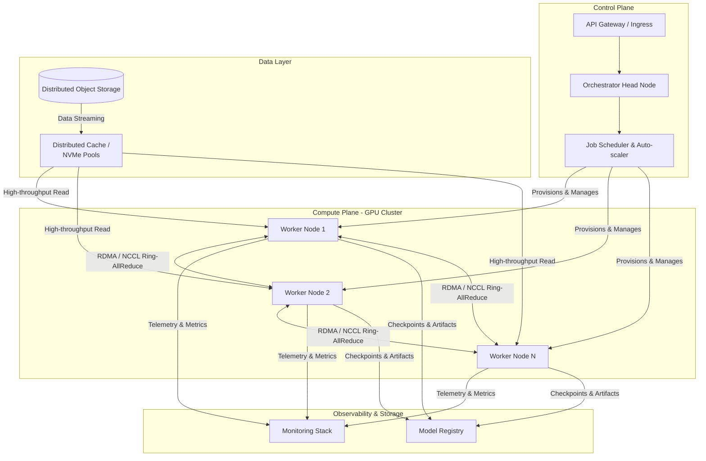

# Highly Distributed LLM Training System Architecture

## 1. Architecture Overview

The proposed architecture outlines a cloud-agnostic, microservices-based distributed machine learning training system designed for training Large Language Models (LLMs) or complex deep neural networks. It leverages an orchestrator (like Kubernetes running Ray or Kubeflow) to manage ephemeral GPU/TPU compute nodes. 

To achieve massive scale, the system utilizes a **Compute Plane** optimized for Data and Tensor Parallelism using high-bandwidth interconnects (e.g. RDMA/InfiniBand) to synchronize gradients without a traditional bottleneck. A highly decoupled **Data Layer** streams massive datasets through a distributed cache layer to prevent GPU starvation, while an isolated **Observability & Storage Layer** handles model checkpointing, experiment tracking, and cluster telemetry. 

## 2. Architecture Diagram

## 3. Well-Architected Framework Analysis

### Operational Excellence
* **Infrastructure as Code (IaC):** The entire stack (networking, storage, compute clusters) is provisioned using IaC tools (e.g. Terraform), enabling reproducible environments across different cloud providers or on-premises data centers.
* **GitOps Deployment:** Job configurations and infrastructure changes are managed via GitOps (e.g. ArgoCD), ensuring version control, audibility, and automated rollbacks of training configurations.
* **Centralized Telemetry:** Deep integration with a monitoring stack (Prometheus, Grafana, ELK) provides real-time visibility into GPU utilization, memory bottlenecks, and network throughput, allowing operators to diagnose stalled training jobs instantly.

### Security
* **Network Isolation:** Compute nodes are placed in private subnets with strict security groups. No inbound internet access is permitted; egress is routed through a NAT gateway or restricted via egress filtering.
* **Role-Based Access Control (RBAC):** Strict RBAC policies govern who can submit, modify, or delete training jobs. Least-privilege IAM roles are attached to worker nodes, granting them access only to specific object storage buckets.
* **Data Protection:** All training data is encrypted at rest (using AES-256 and managed KMS keys) and in transit (via TLS for API calls and encrypted RDMA traffic for inter-node communication).

### Reliability
* **Automated Checkpointing:** The system frequently synchronizes model weights and optimizer states to persistent object storage. If a node fails, the scheduler restarts the pod, and training resumes from the last checkpoint, minimizing lost compute time.
* **Fault-Tolerant Orchestration:** The control plane (Head Node and Schedulers) is deployed across multiple Availability Zones (AZs) with leader election to ensure high availability.
* **Health Probes & Auto-Recovery:** Kubernetes continuously monitors worker node health. Unresponsive nodes or GPUs with hardware faults (e.g. ECC memory errors) are automatically cordoned and replaced.

### Performance Efficiency
* **High-Speed Interconnects:** Inter-node gradient synchronization utilizes RDMA (Remote Direct Memory Access) over InfiniBand or specialized cloud networking (e.g. AWS EFA), bypassing the CPU to reduce latency and overhead.
* **Optimized Data Pipeline:** To prevent GPUs from idling while waiting for data, datasets are streamed from object storage into a distributed NVMe cache layer (e.g. Alluxio), keeping data local to the compute instances.
* **Collective Communications:** Utilizing NCCL (NVIDIA Collective Communications Library) with a Ring-AllReduce topology ensures that bandwidth scales linearly with the number of GPUs, preventing network bottlenecks during gradient aggregation.

### Cost Optimization
* **Heterogeneous Compute / Spot Instances:** For fault-tolerant workloads, worker nodes can be provisioned using preemptible/Spot instances, significantly reducing compute costs.
* **Scale-to-Zero:** The auto-scaler dynamically provisions GPU nodes only when a training job is queued and tears them down immediately upon completion (or failure), eliminating idle cluster costs.
* **Right-Sizing Storage:** Hot data is kept in expensive NVMe caches only during active epochs, while massive raw datasets and historical checkpoints reside in cheaper, lower-tier object storage.

### Sustainability
* **Resource Utilization:** By maximizing GPU utilization through advanced scheduling and data pipelining, the system reduces the time-to-train, directly lowering the overall energy consumption of the workload.
* **Carbon-Aware Region Selection:** Because the architecture is cloud-agnostic, training jobs can be scheduled in geographic regions powered by higher percentages of renewable energy, depending on latency and data sovereignty constraints.
* **Hardware Lifecycle Efficiency:** Supporting distributed training across older generation GPUs (via efficient pipeline parallelism) extends the usable life of hardware, reducing e-waste.

---

## 4. Technical Glossary

* **API Gateway / Ingress:** An API management tool that sits between a client and a collection of backend services, acting as a reverse proxy to route requests securely.
* **Data / Tensor Parallelism:** Distributed training techniques. Data Parallelism splits the dataset across multiple GPUs (each holding a copy of the model). Tensor Parallelism splits the model's internal matrices across multiple GPUs when the model is too large to fit in a single GPU's memory.
* **ELK Stack:** A collection of three open-source products (Elasticsearch, Logstash, and Kibana) used for searching, analyzing, and visualizing log data in real time.
* **IAM (Identity and Access Management):** A framework of policies and technologies to ensure the right users and services have the appropriate access to technology resources.
* **KMS (Key Management Service):** A secure service used to create and manage cryptographic keys that protect data.
* **Microservices:** An architectural style that structures an application as a collection of loosely coupled, independently deployable services.
* **NCCL (NVIDIA Collective Communications Library):** A library of multi-GPU collective communication primitives that are topology-aware, heavily used to synchronize gradients across GPUs.
* **NVMe (Non-Volatile Memory Express):** A highly scalable storage protocol that connects the host to the memory subsystem, providing exceptionally high bandwidth and low latency for local caching.
* **Orchestrator (Kubernetes/Ray):** Software that automates the deployment, scaling, and management of containerized applications and distributed compute jobs.
* **RDMA (Remote Direct Memory Access):** A technology that allows a computer to access the memory of another computer without involving either one's operating system or CPU, resulting in high throughput and low-latency networking.
* **Ring-AllReduce:** A network algorithm used in distributed machine learning where GPUs are arranged in a logical ring. It allows multiple nodes to efficiently aggregate gradients without relying on a single, bottlenecked parameter server. 
* **Spot Instances / Preemptible VMs:** Spare compute capacity offered by cloud providers at steep discounts. They can be interrupted (terminated) by the provider at any time if capacity is needed elsewhere.
