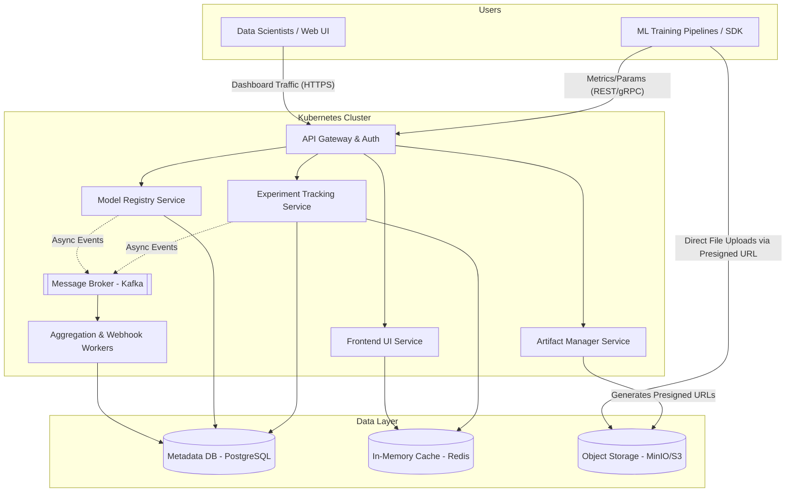

# ML Experiment Tracking and Analysis Platform Architecture

## 1. Architecture Overview

The proposed solution is a highly scalable, cloud-agnostic microservices architecture designed to track, visualize, and manage machine learning experiments. Built to support modern MLOps workflows, the platform provides a centralized system of record for model training code, hyperparameters, evaluation metrics, and large artifacts (like model weights and datasets). 

To ensure cloud portability and resilience, the architecture leverages Kubernetes for orchestration, PostgreSQL for structured metadata, and S3-compatible object storage (e.g. MinIO) for heavy artifact blobs. The design explicitly decouples high-throughput metric ingestion from heavy artifact uploads, utilizing presigned URLs to route massive files directly to object storage, bypassing the application backend to preserve compute performance.

## 2. Architecture Diagram

## 3. Well-Architected Framework Analysis

### Operational Excellence
* **Infrastructure as Code (IaC):** The entire stack is provisioned using Terraform, and Kubernetes workloads are managed via Helm charts, ensuring environments (Dev, Staging, Prod) are reproducible.
* **Observability:** OpenTelemetry is integrated across all microservices for distributed tracing. Prometheus scrapes application metrics, and Grafana provides real-time dashboards for platform health monitoring.
* **Automated CI/CD:** Continuous integration runs unit and integration tests on every commit, while GitOps tools (like ArgoCD) handle automated rollouts of new microservice versions.

### Security
* **Authentication & Authorization:** The API Gateway integrates with an OIDC-compliant Identity Provider (e.g. Keycloak) for Single Sign-On (SSO). Role-Based Access Control (RBAC) ensures users can only view or edit experiments within their authorized workspaces.
* **Zero Trust & Secrets:** Traffic between microservices is encrypted via a service mesh (e.g. Istio) utilizing mTLS. API keys and database credentials are securely injected via HashiCorp Vault.
* **Data Security:** Presigned URLs restrict artifact uploads/downloads to temporary, time-bound windows. All storage layers (PostgreSQL, Object Storage) enforce AES-256 encryption at rest.

### Reliability
* **High Availability:** All microservices are stateless and deployed as Kubernetes ReplicaSets spread across multiple Availability Zones (AZs) to survive node or zone failures.
* **Asynchronous Processing:** High-throughput logging during hyperparameter sweeps is buffered through Kafka, preventing database connection exhaustion during peak distributed training runs.
* **Disaster Recovery:** Automated, point-in-time PostgreSQL backups and cross-region replication for object storage guarantee business continuity.

### Performance Efficiency
* **Direct-to-Storage Uploads:** By allowing the ML SDK to upload large tensor arrays and model weights directly to the Object Store via presigned URLs, the platform prevents network bottlenecks and memory bloat on the application servers.
* **Caching Layer:** Redis caches frequently accessed queries (e.g. dashboard leaderboards, active experiment states), accelerating web UI load times when comparing hundreds of runs.
* **Protocol Optimization:** Utilizing gRPC for the tracking SDK minimizes payload overhead, drastically speeding up high-frequency metric logging from training loops.

### Cost Optimization
* **Resource Auto-scaling:** Kubernetes Horizontal Pod Autoscalers (HPA) automatically scale down tracking services during off-peak hours and scale up when large training clusters spin up.
* **Storage Tiering:** Object storage lifecycle policies automatically transition older, un-promoted ML artifacts (like failed experiment epochs) to cheaper cold storage tiers.
* **Open-Source Foundations:** Using cloud-agnostic tools (MinIO, PostgreSQL, Kafka) avoids premium managed-service markups and mitigates vendor lock-in.

### Sustainability
* **Compute Density:** Container orchestration densely packs workloads onto the minimum required number of nodes, reducing the idle carbon footprint of the underlying infrastructure.
* **Efficient Data Formats:** Storing historical metrics in columnar formats (like Parquet) reduces I/O operations and disk footprint, leading to lower overall energy consumption in the data layer.

## 4. Technical Glossary

* **API Gateway:** A server that acts as an API front-end, receiving API requests, enforcing throttling and security policies, passing requests to the back-end service, and then passing the response back to the requester.
* **gRPC:** A high-performance, open-source universal RPC (Remote Procedure Call) framework that uses Protocol Buffers for fast, compact data serialization.
* **Helm:** A package manager for Kubernetes that simplifies the deployment and management of complex distributed applications.
* **Microservices:** An architectural style that structures an application as a collection of loosely coupled, independently deployable services organized around business capabilities.
* **mTLS (Mutual TLS):** A security protocol where both the client and the server authenticate each other's digital certificates, ensuring traffic is secure and trusted in both directions.
* **OIDC (OpenID Connect):** An identity layer built on top of the OAuth 2.0 framework that allows clients to verify the identity of an end-user based on authentication performed by an authorization server.
* **Object Storage (e.g. MinIO/S3):** A computer data storage architecture that manages data as objects (unlike file systems or block storage), ideal for storing unstructured data like massive ML model weights and datasets.
* **Presigned URL:** A URL generated by an object storage service that grants temporary, limited access to upload or download a specific object without requiring ongoing administrative credentials.
* **ReplicaSet:** A Kubernetes process that maintains a stable set of replica Pods running at any given time, guaranteeing the availability of a specified number of identical Pods.
* **Service Mesh:** A dedicated infrastructure layer for facilitating service-to-service communications between microservices, often handling encryption, observability, and load balancing.
