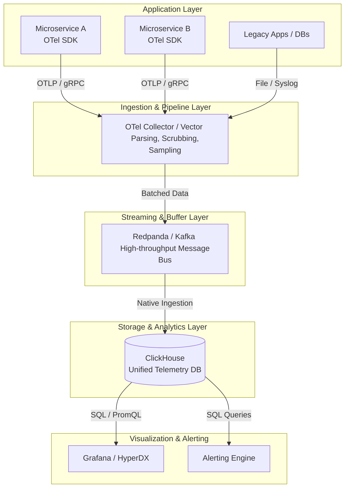

# High-Performance Telemetry Pipeline

## 1. Architecture Overview
The proposed solution implements a unified, high-performance telemetry pipeline reflecting modern 2026 observability best practices. Instead of the traditional fragmented "three pillars" approach (e.g. Prometheus for metrics, Elasticsearch for logs, Jaeger for traces), this architecture leverages **OpenTelemetry** for standardized data generation and collection, **Vector** (or OTel Collector) for high-performance edge processing and routing, a streaming broker (**Redpanda/Kafka**) for backpressure management, and a unified OLAP database (**ClickHouse**) for storage and analytical querying. This single-datastore approach significantly reduces storage costs, eliminates UI context-switching, and allows for millisecond-latency analytical correlation across logs, metrics, and traces. 

## 2. Architecture Diagram

## 3. Well-Architected Framework Analysis

### Operational Excellence
By standardizing on OpenTelemetry (OTLP), development teams write instrumentation once without vendor lock-in. Vector/OTel Collectors deployed as DaemonSets or sidecars handle local aggregation and routing automatically. Using a single data store (ClickHouse) drastically reduces the operational burden of managing, securing, and upgrading multiple specialized stateful systems.

### Security
The ingestion pipeline enforces data masking, scrubbing of Personally Identifiable Information (PII), and token-based authentication at the collector level before data ever hits the storage tier. Mutual TLS (mTLS) secures data in transit across all microservice hops, and role-based access control (RBAC) in the visualization layer restricts query access based on organizational or team boundaries.

### Reliability
The inclusion of Redpanda/Kafka as a persistent buffer guarantees no data loss during sudden system traffic spikes or downstream database maintenance. If the ClickHouse cluster is temporarily unavailable, telemetry data queues safely in the broker. The stateless collector layer scales horizontally and automatically via standard auto-scaling groups or Kubernetes HPAs.

### Performance Efficiency
ClickHouse, a columnar analytical database, utilizes vectorized query execution to scan billions of telemetry rows in sub-seconds. Vector (written in Rust) provides massive throughput at the ingestion layer with an extremely low CPU and memory footprint compared to legacy log shippers or Java-based agents.

### Cost Optimization
Storing metrics, logs, and traces in a single columnar database with aggressive data compression reduces the storage footprint by up to $70\%$ compared to indexed document stores like Elasticsearch. Head-based and tail-based sampling configured at the collector layer drops low-value, repetitive debug data before it incurs network egress or backend storage costs.

### Sustainability
Optimized resource usage at both the ingestion (Rust-based pipeline) and storage (columnar compression) tiers translates directly to fewer compute instances required. Edge aggregation and intelligent sampling minimize unnecessary network payload sizes, directly lowering the overall carbon footprint of the observability infrastructure.

## 4. Technical Glossary

* **OpenTelemetry (OTel):** An open-source observability framework providing standardized SDKs, APIs, and tools to generate and manage telemetry data (metrics, logs, traces) uniformly.
* **OTLP:** OpenTelemetry Protocol, the standard encoding and transport protocol for OTel data.
* **Vector:** A high-performance, lightweight observability pipeline tool used to parse, transform, and route telemetry data efficiently.
* **ClickHouse:** A fast open-source OLAP (Online Analytical Processing) columnar database management system, highly optimized for real-time analytics and massive telemetry ingestion.
* **Redpanda:** A Kafka-compatible streaming data platform engineered in C++ for high throughput and low latency without JVM overhead.
* **OLAP:** Online Analytical Processing, a computing approach that answers multi-dimensional analytical queries swiftly, well-suited for aggregated metrics and logs.
* **Tail-based Sampling:** A tracing sampling method where the decision to keep or drop a trace is made after the entire trace is complete, ensuring anomalous or erroneous traces are always captured while discarding normal traffic.
