# Distributed Rate Limiter

### 1. Architecture Overview

A distributed rate limiter is a critical infrastructure component designed to control the flow of traffic to your backend microservices. Its primary goals are to prevent resource exhaustion, mitigate Distributed Denial of Service (DDoS) attacks, enforce API quotas, and ensure fair usage among tenants. 

In this cloud-agnostic microservices design, the API Gateway acts as the first line of defense, intercepting incoming traffic. Before routing a request to the downstream backend services, the Gateway queries a dedicated, low-latency Rate Limiting Service. This service relies on a high-performance in-memory datastore (typically Redis) to track request counts using atomic operations, such as Lua scripts, to handle high concurrency without race conditions. A persistent configuration database stores the rate-limiting rules (e.g., "100 requests per minute per IP" or "10,000 requests per day per API Key"), which are cached locally by the Rate Limiter Service for rapid access.

If a request exceeds its allocated quota, the API Gateway immediately drops the request and returns an HTTP 429 (Too Many Requests) response. Otherwise, the request is routed to the target microservice.

---

### 2. Architecture Diagram

```mermaid
graph TD
    %% Client and Entry Point
    Client[Client Applications / Users] -->|HTTP/HTTPS| WAF[Web Application Firewall / Load Balancer]
    WAF --> APIGW[API Gateway]

    %% Rate Limiting Subsystem
    subgraph Rate Limiting Subsystem
        APIGW -->|Check Quota| RLS[Rate Limiting Service]
        RLS <-->|Atomic Counters/Lua Scripts| Cache[(Redis Cluster)]
        RLS <-->|Fetch Rules| CacheRules[(Local Rules Cache)]
        ConfigWorker[Config Sync Worker] -->|Push Updates| CacheRules
        ConfigDB[(Configuration DB)] -->|Store Limits| ConfigWorker
    end

    %% Backend Services
    APIGW -->|Route Allowed Traffic| Microservices[Backend Microservices]
    
    %% Async Logging / Metrics
    RLS -.->|Async Metrics| Telemetry[Observability & Monitoring]

    classDef external fill:#f9f9f9,stroke:#333,stroke-width:2px;
    classDef core fill:#e1f5fe,stroke:#0288d1,stroke-width:2px;
    classDef storage fill:#fff3e0,stroke:#f57c00,stroke-width:2px;
    
    class Client,WAF external;
    class APIGW,RLS,ConfigWorker,Microservices core;
    class Cache,ConfigDB,Telemetry storage;
```

---

### 3. Well-Architected Framework Analysis

#### Operational Excellence
* **Dynamic Configuration:** Rate limiting rules are decoupled from the code. Rules can be updated in the Configuration DB and synced dynamically to the Rate Limiting Service without requiring a redeployment or service restart.
* **Observability:** The system asynchronously emits metrics on request volumes, throttled requests (HTTP 429s), and latency. This enables operations teams to set up alerts for sudden traffic spikes or misconfigured rules.
* **Deployment Automation:** All components, including the Redis cluster and microservices, should be deployed using Infrastructure as Code (IaC) and managed via automated CI/CD pipelines to ensure consistency across environments.

#### Security
* **DDoS Mitigation & WAF Integration:** While the WAF handles volumetric layer 3/4 attacks, the rate limiter protects against layer 7 application-level abuse, brute-force attacks, and credential stuffing.
* **Identity-Based Throttling:** The API Gateway validates tokens (e.g., JWTs) or API keys before querying the rate limiter. This ensures limits are accurately applied per user, per tenant, or per IP address.
* **Sanitization:** Input validation occurs at the API Gateway level to ensure malicious payloads do not reach the Rate Limiting Service or backend systems.

#### Reliability
* **High Availability:** The Redis datastore operates in a clustered mode with primary-replica replication and automated failover (e.g., Redis Sentinel) to prevent a single point of failure.
* **Fail-Open vs. Fail-Closed Strategy:** The API Gateway is configured with a "fail-open" strategy. If the Rate Limiting Service or Redis cluster experiences an outage, requests are allowed to pass through temporarily rather than bringing down the entire API, ensuring business continuity.
* **Circuit Breakers:** Implemented between the API Gateway and the Rate Limiting Service to prevent cascading failures if the cache becomes unresponsive.

#### Performance Efficiency
* **Sub-Millisecond Latency:** By utilizing Redis (an in-memory store) and executing rate-limiting algorithms via embedded Lua scripts, the system avoids network round-trips for multi-step database transactions.
* **Algorithm Selection:** Depending on the business need, highly efficient algorithms like **Token Bucket** or **Fixed Window Counter** are used. These require minimal memory footprint per user compared to memory-heavy algorithms like Sliding Window Log.
* **Local Caching:** Rule configurations are cached locally in the memory of the Rate Limiting Service nodes to avoid querying the persistent Configuration DB on every request.

#### Cost Optimization
* **Efficient Resource Utilization:** Memory is strictly managed by setting Time-To-Live (TTL) values on all Redis keys. Keys expire automatically once the time window passes, preventing memory bloat and reducing infrastructure costs.
* **Right-Sizing Compute:** The Rate Limiting Service is built as a lightweight, stateless microservice, allowing it to scale horizontally and automatically based on CPU or network throughput, meaning you only pay for compute during traffic spikes.
* **Tiered Telemetry Storage:** High-frequency throttling logs are aggregated in-memory before being flushed to cheaper, long-term storage (like object storage) for audit purposes.

#### Sustainability
* **Minimized Carbon Footprint:** By rejecting excessive traffic at the edge (API Gateway), backend services are spared from processing heavy, unauthorized, or abusive workloads, saving significant compute cycles and energy.
* **Optimized Memory Footprint:** Selecting the Token Bucket algorithm reduces the number of state variables stored per user to just two (current tokens and last updated timestamp), highly optimizing RAM usage and reducing the physical server footprint required for the cache cluster.

---

### 4. Technical Glossary

* **API Gateway:** A server that acts as an API front-end, receiving API requests, enforcing throttling and security policies, passing requests to the back-end service, and then passing the response back to the requester.
* **Circuit Breaker:** A design pattern used to detect failures and encapsulate the logic of preventing a failure from constantly recurring, during maintenance, temporary external system failure, or unexpected system difficulties.
* **DDoS (Distributed Denial of Service):** A malicious attempt to disrupt the normal traffic of a targeted server, service, or network by overwhelming the target or its surrounding infrastructure with a flood of Internet traffic.
* **Fail-Open:** A system design strategy where, in the event of a failure within a specific component (like the rate limiter), the system defaults to allowing traffic through to maintain availability, rather than blocking all traffic (Fail-Closed).
* **HTTP 429:** The HTTP response status code used to indicate "Too Many Requests". It tells the client that they have sent too many requests in a given amount of time.
* **JWT (JSON Web Token):** A compact, URL-safe means of representing claims to be transferred between two parties. Often used for authentication and identifying which rate-limiting tier a user belongs to.
* **Lua Scripting:** A lightweight, high-level programming language. In this context, it is embedded within Redis to execute complex operations (like checking and decrementing a counter) atomically in a single step, preventing race conditions.
* **Race Condition:** A software flaw where the output is dependent on the sequence or timing of other uncontrollable events. In rate limiting, it happens when two concurrent requests read the same quota counter before either can update it.
* **Redis (Remote Dictionary Server):** An open-source, in-memory data structure store, used as a database, cache, and message broker. Ideal for rate limiting due to its extreme speed.
* **Token Bucket Algorithm:** A highly efficient rate-limiting algorithm. Imagine a bucket that holds a certain number of tokens. Tokens are added to the bucket at a fixed rate. Every request consumes a token. If the bucket is empty, the request is dropped.
* **TTL (Time-To-Live):** A mechanism that limits the lifespan or lifetime of data in a computer or network. Used in Redis to automatically delete rate-limiting counters once their time window has expired.
* **WAF (Web Application Firewall):** A specific form of application firewall that filters, monitors, and blocks HTTP traffic to and from a web service to protect against common web exploits.
