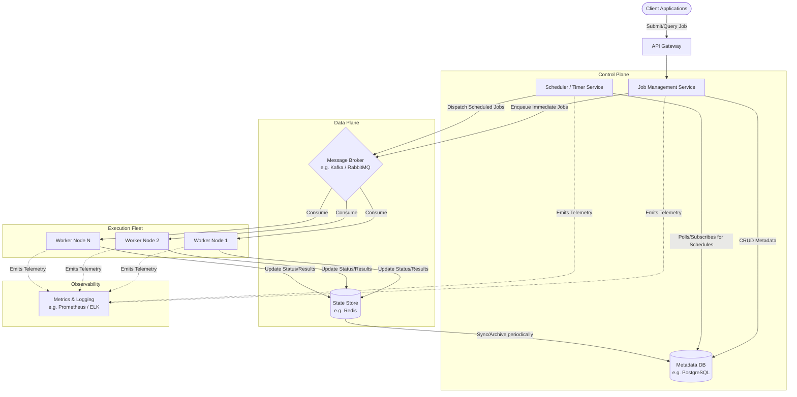

# Distributed Job Scheduling System Architecture

## 1. Architecture Overview

The proposed solution is a highly available, horizontally scalable, cloud-agnostic distributed job scheduling system. It utilizes a microservices architecture to decouple job submission, scheduling, and execution. Clients interact with the system via an API Gateway to submit jobs, which are then persisted in a highly durable Metadata Database. A Scheduler Service handles time-based triggers (such as cron jobs or delayed executions) and pushes ready-to-run jobs into a distributed Message Broker. A scalable fleet of Worker Nodes consumes these messages asynchronously, executes the workload, and updates the job's state in a fast, in-memory State Store. The system is designed to handle transient failures gracefully, ensuring at-least-once delivery with idempotent worker execution.

## 2. Architecture Diagram

## 3. Well-Architected Framework Analysis

### Operational Excellence
* **Infrastructure as Code (IaC):** The entire stack is provisioned using IaC tools (e.g. Terraform or Pulumi) to ensure repeatable and consistent environments.
* **Observability:** Centralized logging (e.g. ELK/EFK stack) and metrics collection (e.g. Prometheus/Grafana) are implemented across all components. Distributed tracing is used to track job lifecycles from submission to completion.
* **Automated Deployments:** CI/CD pipelines automate testing and deployment, allowing for zero-downtime rolling updates of worker nodes and control plane services.

### Security
* **Authentication & Authorization:** The API Gateway enforces JWT-based authentication. Role-Based Access Control (RBAC) ensures clients can only query or modify their own jobs.
* **Data Protection:** Data is encrypted at rest in the Metadata DB and State Store. All in-transit communication between microservices uses TLS (Transport Layer Security).
* **Least Privilege:** Worker nodes are assigned IAM roles (or service accounts in Kubernetes) with strict, least-privilege permissions required only for the specific job types they execute.

### Reliability
* **Fault Isolation & Decoupling:** The Message Broker decouples job submission from execution. If the worker fleet goes down, jobs remain safely queued without impacting the client-facing APIs.
* **Resiliency Patterns:** Worker nodes implement retry logic with exponential backoff for transient failures. A Dead Letter Queue (DLQ) captures persistently failing jobs for manual inspection without blocking the pipeline.
* **High Availability:** All services, including the DB and message broker, are deployed across multiple availability zones (AZs) to survive infrastructure failures. The Scheduler Service utilizes a distributed lock or leader election to prevent duplicate scheduling.

### Performance Efficiency
* **Horizontal Scalability:** The Worker Fleet automatically scales up and down based on the queue depth metric (e.g., using Kubernetes HPA or KEDA).
* **High-Throughput State Management:** An in-memory key-value store (Redis) is utilized for high-speed job state updates, preventing bottlenecks on the primary relational database.
* **Asynchronous Processing:** Long-running jobs do not block client requests. The system operates asynchronously, returning a job ID immediately for subsequent status polling or webhook callbacks.

### Cost Optimization
* **Elastic Compute:** By scaling worker nodes dynamically based on queue depth, compute resources are only consumed when there is an active backlog of jobs.
* **Spot/Preemptible Instances:** For fault-tolerant, idempotent workloads, worker nodes can be provisioned on cheaper Spot or Preemptible instances, significantly reducing compute costs.
* **Right-Sizing Storage:** Job metadata and logs are lifecycle-managed. Completed or failed job details are archived to cheaper object storage (e.g., S3-compatible storage) after a predefined retention period.

### Sustainability
* **Scale-to-Zero:** In non-production environments or during periods of zero traffic, the worker fleet can scale down to zero to minimize idle power consumption and carbon footprint.
* **Efficient Resource Utilization:** Microservices can be written in highly performant, low-resource languages (like Go or Rust) to maximize job throughput per CPU cycle, optimizing the underlying hardware usage.

## 4. Technical Glossary

* **API Gateway:** A server that acts as an API front-end, receiving API requests, enforcing throttling and security policies, passing requests to the back-end service, and then passing the response back to the requester.
* **Microservices Architecture:** An architectural style that structures an application as a collection of loosely coupled, independently deployable services.
* **Message Broker:** An intermediary computer program module that translates a message from the formal messaging protocol of the sender to the formal messaging protocol of the receiver (e.g., Kafka, RabbitMQ).
* **Metadata DB:** A database used to store data providing information about one or more aspects of the jobs (e.g., job owner, schedule time, payload, current status).
* **State Store:** A database, typically a fast, in-memory key-value store (like Redis), used to track the real-time execution state of jobs.
* **Idempotency:** A property of operations in mathematics and computer science whereby an operation can be applied multiple times without changing the result beyond the initial application. Crucial for workers to safely retry failed jobs.
* **Dead Letter Queue (DLQ):** A service implementation to store messages that meet one or more failure criteria (e.g., maximum retries exceeded) for later analysis.
* **JWT (JSON Web Token):** An open standard used to share security information between two parties securely.
* **RBAC (Role-Based Access Control):** A method of restricting network access based on the roles of individual users within an enterprise.
* **Horizontal Pod Autoscaler (HPA) / KEDA:** Kubernetes-native tools used to automatically scale the number of pods in a deployment based on observed metrics (like CPU utilization or queue length).
* **Leader Election:** A process in a distributed computing architecture for designating a single process as the organizer of some task distributed among several computers (used here to ensure only one scheduler service triggers a specific time-based job).
* **Spot / Preemptible Instances:** Excess compute capacity offered by cloud providers at steep discounts, with the caveat that they can be interrupted or reclaimed by the provider with minimal notice.
