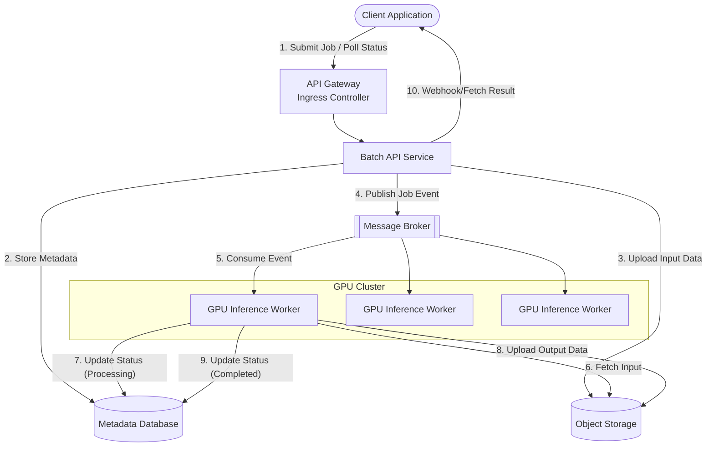

# Batch Inference API Architecture for GPU Clusters

## 1. Architecture Overview

This proposed solution outlines a cloud-agnostic, microservices-based architecture designed to handle asynchronous batch inference workloads efficiently on a GPU cluster. Because batch inference processes large volumes of data without the strict latency requirements of real-time inference, the architecture prioritizes throughput, high availability, and cost-efficient GPU utilization. 

The core design decouples the client-facing API from the heavy lifting of the GPU workers using an asynchronous message-driven pattern. Clients submit inference jobs (text, images, or audio) to an API Server, which uploads the raw payload to an Object Storage system and queues a reference message in a Message Broker. A pool of GPU-enabled worker nodes, managed by an orchestrator like Kubernetes, pulls these messages, performs the inference using an optimized model server, writes the results back to Object Storage, and updates the job metadata. Clients can then retrieve their results via polling or a webhook callback.

## 2. Architecture Diagram

## 3. Well-Architected Framework Analysis

### Operational Excellence
* **Infrastructure as Code (IaC):** The entire stack should be provisioned using tools like Terraform or Pulumi to ensure environments are reproducible and version-controlled.
* **Observability:** Implement centralized logging and metrics collection (e.g., Prometheus and Grafana). It is critical to monitor queue depth, API latency, and specifically **GPU utilization metrics** (memory usage, SM clock utilization) to ensure the workers are actually busy and not idling.
* **Automated Deployments:** Use CI/CD pipelines to manage model updates and service deployments, utilizing strategies like canary or blue/green deployments to prevent downtime during model weight updates.

### Security
* **Data Protection:** Enforce TLS for all data in transit. Ensure data at rest in the Object Storage and Metadata Database is encrypted.
* **Identity and Access Management (IAM):** Use RBAC (Role-Based Access Control) to ensure the API Server only has write access to input buckets and the Database, while workers have scoped access to read inputs, write outputs, and update job statuses.
* **Network Isolation:** Keep the GPU cluster and Message Broker in a private subnet, exposing only the API Gateway to external or cross-service traffic.

### Reliability
* **Decoupling:** The Message Broker (e.g., Kafka, RabbitMQ) prevents the API from crashing under sudden spikes in workload. If the GPU cluster goes down, the API can still accept jobs.
* **Fault Tolerance:** Use Dead-Letter Queues (DLQs) for jobs that fail inference multiple times (e.g., due to corrupt input data or OOM errors). This prevents "poison pill" messages from blocking the queue indefinitely.
* **Resiliency:** The stateless nature of the GPU workers means that if a node fails, the job can safely be re-queued and picked up by another healthy node.

### Performance Efficiency
* **Dynamic Batching:** Utilize inference engines like Triton Inference Server or vLLM inside the GPU workers. These tools can pool multiple individual requests together at the hardware level to maximize GPU parallel processing.
* **Autoscaling based on Queue Depth:** Use tools like KEDA (Kubernetes Event-driven Autoscaling) to scale the number of GPU worker pods based on the length of the Message Broker queue, ensuring resources are only active when work exists.
* **Data Locality:** Ensure the Object Storage is provisioned in the same region/network as the GPU cluster to minimize network transfer times for large payload fetching.

### Cost Optimization
* **Spot/Preemptible Instances:** Because batch workloads are asynchronous and fault-tolerant, the GPU worker nodes are ideal candidates for Spot instances (cloud provider's excess capacity at a steep discount).
* **Scale-to-Zero:** The autoscaling mechanism should be configured to scale the GPU worker pool down to zero when the queue is entirely empty, eliminating costly idle GPU time.
* **Right-Sizing:** Profile the inference model to choose the right GPU tier. Not all models require flagship GPUs; older or specialized inference chips might offer a better price-to-performance ratio.

### Sustainability
* **Model Optimization:** Implement quantization (e.g., INT8, FP8) to reduce the memory footprint and compute requirements of the model, lowering the overall energy required per inference.
* **Hardware Efficiency:** Maximizing GPU utilization (via dynamic batching and scale-to-zero) ensures the physical hardware operates at its peak energy efficiency curve, rather than drawing power while idling. 
* **Carbon-Aware Scheduling:** If deploying across multiple regions, route non-time-sensitive batch jobs to data centers powered primarily by renewable energy sources, or delay execution until grid carbon intensity is lower.

## 4. Technical Glossary

* **API Gateway:** A management tool that sits between a client and a collection of backend services, acting as a reverse proxy to route requests, manage traffic, and enforce security policies.
* **Asynchronous Processing:** A design pattern where a system accepts a request, immediately acknowledges receipt, and processes the heavy workload in the background without making the user wait for the final result.
* **Dead-Letter Queue (DLQ):** A secondary queue where messages that fail to process successfully (after a certain number of retries) are sent for manual inspection and debugging.
* **Dynamic Batching:** An optimization technique where an inference server groups multiple independent inference requests together into a single "batch" right before sending them to the GPU, significantly increasing throughput.
* **GPU (Graphics Processing Unit):** Highly parallelized hardware accelerators that are uniquely suited for the matrix multiplication operations required by machine learning models.
* **KEDA (Kubernetes Event-driven Autoscaling):** A tool that drives the autoscaling of Kubernetes workloads based on metrics from external event sources, like the number of pending messages in a queue.
* **Message Broker / Queue:** A middleware service (e.g., RabbitMQ, Apache Kafka, Redis) that temporarily stores messages or events from a producer until a consumer is ready to process them.
* **Object Storage:** A data storage architecture that manages data as objects (e.g., AWS S3, MinIO) rather than file hierarchies or blocks. Ideal for storing large, unstructured payloads like images or massive text files.
* **Poison Pill:** A message in a queue that continuously causes the consuming application to crash or fail, potentially creating an infinite loop of failures if not isolated.
* **Quantization:** A technique to compress a machine learning model by reducing the precision of its weights (e.g., moving from 32-bit floating point to 8-bit integers), which saves memory and speeds up inference with minimal loss in accuracy.
* **Spot / Preemptible Instances:** Cloud computing instances available at a steep discount, with the caveat that the cloud provider can terminate them at any time if they need the capacity back.
* **Triton Inference Server / vLLM:** Specialized, high-performance open-source software designed to serve machine learning models efficiently on GPUs.
