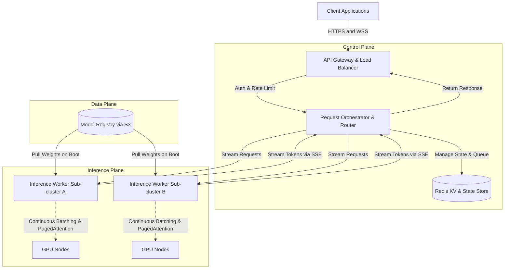

# High-Throughput LLM Inference API & Orchestration Architecture

## 1. Architecture Overview
This architecture delivers a highly scalable, low-latency API for sampling from Large Language Models (LLMs). It decouples the client-facing API Gateway from the heavy GPU inference compute using a high-performance Orchestration Layer. To maximize throughput and efficiency, the inference engines utilize Continuous Batching (iteration-level scheduling) and PagedAttention for optimal Key-Value (KV) cache memory management. Distributed request queues ensure smooth handling of traffic spikes, while the Orchestrator manages streaming states and routes requests to the appropriately sized GPU worker pools.

## 2. Architecture Diagram

## 3. Well-Architected Framework Analysis
* **Operational Excellence:** Centralized logging and telemetry capture LLM-specific metrics (Time-to-First-Token, Time-Per-Output-Token, GPU memory utilization, queue depth) via Prometheus and Grafana. Model weights are version-controlled in object storage for consistent, immutable deployments.
* **Security:** The API Gateway handles TLS termination, Identity Provider integration, and token-bucket rate limiting (based on requested tokens, not just request count) to prevent Denial of Wallet (DoW) attacks. Inference workers sit in private subnets with no public ingress.
* **Reliability:** The orchestration layer acts as a shock absorber during traffic spikes, queuing requests instead of dropping them or overwhelming the GPUs. Circuit breakers isolate failing inference workers, automatically dead-lettering and retrying stalled queries.
* **Performance Efficiency:** Continuous batching prevents head-of-line blocking by ejecting finished requests and injecting new ones at the token-generation iteration level. PagedAttention eliminates memory fragmentation, allowing the system to fit significantly more concurrent requests into GPU memory.
* **Cost Optimization:** Horizontal Pod Autoscalers (HPA) scale GPU nodes based on custom metrics like queue depth and KV-cache utilization, rather than generic CPU metrics. Token-aware routing ensures small requests aren't sent to massive, expensive multi-GPU clusters.
* **Sustainability:** Maximizing GPU tensor core utilization (via continuous batching) ensures that energy consumption directly translates to processed tokens, heavily minimizing the high carbon cost of idle GPU compute time.

## 4. Technical Glossary
* **Continuous Batching:** An optimization where incoming requests are dynamically added to the execution batch at the token-generation step, rather than waiting for an entire static batch of sequences to finish processing.
* **PagedAttention:** A memory management algorithm that stores continuous KV cache values in non-contiguous virtual memory blocks (similar to an OS), virtually eliminating memory fragmentation.
* **KV Cache (Key-Value Cache):** Memory used to store previously computed keys and values in the Transformer attention mechanism, saving compute cycles so past tokens don't need to be recalculated.
* **Time-to-First-Token (TTFT):** The time elapsed between a client sending the request and receiving the very first generated text token.
* **Time-Per-Output-Token (TPOT):** The average time taken to generate each subsequent token after the initial prompt is processed.
* **Server-Sent Events (SSE):** A server push technology enabling a client to receive automatic, real-time streaming text updates over a standard HTTP connection.
