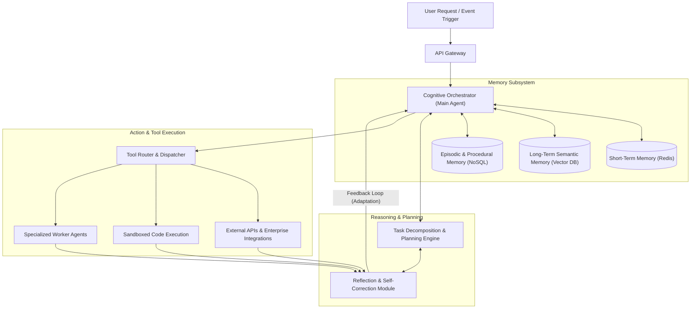

# 1. Architecture Overview

This proposed solution outlines a cloud-agnostic, microservices-based architecture for an autonomous Agentic AI system. Unlike traditional static AI pipelines, this architecture enables the system to perceive, reason, act, and continuously adapt to novel tasks. At its core, a Cognitive Orchestrator (powered by a Large Language Model) drives the decision-making process. The orchestrator is supported by a multi-tiered memory subsystem that retains context and learns from past experiences, a dynamic planning engine for breaking down complex goals, and an isolated tool execution environment for taking action. By leveraging a continuous feedback loop of execution, evaluation, and memory consolidation, the system self-corrects in real-time and autonomously adapts its problem-solving strategies over time.

# 2. Architecture Diagram

# 3. Well-Architected Framework Analysis

### Operational Excellence
* **Observability of Reasoning:** Implementing distributed tracing (e.g., OpenTelemetry) is critical not just for network requests, but for tracking the AI's "Chain of Thought." Every step of perception, planning, action, and reflection is logged as a discrete span to audit the agent's decision-making process.
* **Modular Prompt Management:** System prompts, persona definitions, and tool schemas are decoupled from the core application code and managed via configuration files or a headless CMS. This allows for continuous integration and deployment (CI/CD) of agent logic without requiring full system rebuilds.
* **State Management:** The architecture uses event-driven queues to manage long-running tasks, ensuring the system can pause, resume, and gracefully handle state transitions during multi-step asynchronous operations.

### Security
* **Execution Isolation:** The system utilizes strict sandboxed containerization (e.g., restricted Docker containers or WebAssembly) for the Code Execution engine to prevent malicious code generated by the LLM from compromising the host infrastructure.
* **Principle of Least Privilege:** The Tool Router uses granular, role-based access control (RBAC). The agent is only granted the minimum permissions necessary to interact with external APIs, ensuring that a hallucination or prompt injection attack cannot lead to widespread data mutation.
* **Data Privacy and Redaction:** An interception layer redacts Personally Identifiable Information (PII) and sensitive enterprise data before payloads are sent to external or managed LLM providers.

### Reliability
* **Graceful Degradation:** The system is designed to handle LLM API rate limits and outages through exponential backoff and retry mechanisms. If a primary frontier model fails, the system seamlessly routes requests to a secondary, smaller, or self-hosted fallback model.
* **Resilient Feedback Loops:** If a tool execution fails or returns an error, the Reflection Module automatically catches the exception and feeds it back into the Cognitive Orchestrator, allowing the agent to dynamically rewrite its plan and try an alternative approach rather than failing the entire process.
* **Idempotency:** All tool executions and API integrations are designed to be idempotent to prevent unintended side effects if the agent accidentally triggers the same action multiple times during a retry loop.

### Performance Efficiency
* **Multi-Tiered Caching (Semantic Cache):** To reduce latency and redundant computation, a semantic caching layer intercepts user requests. If a mathematically similar query exists in the Vector DB with a known successful execution path, the system retrieves the cached outcome rather than triggering a full reasoning loop.
* **Dynamic Model Routing:** The architecture routes simpler, deterministic sub-tasks (like formatting or basic data extraction) to smaller, faster, and more efficient models, reserving the massive, computationally heavy LLMs exclusively for the Cognitive Orchestrator's complex reasoning and planning.
* **Asynchronous Execution:** Worker agents and external API calls are executed asynchronously, preventing the main orchestrator thread from blocking while waiting for long-running downstream processes to complete.

### Cost Optimization
* **Token Budgeting and Loop Limits:** Autonomous agents can enter infinite loops if unable to solve a problem, leading to massive LLM billing spikes. The system enforces strict token budgets, depth limits on the reasoning tree, and maximum iteration caps per task.
* **Right-Sizing Compute:** By containerizing the architecture into distinct microservices, you can scale the heavy execution components (like the vector database and sandbox environments) independently from the lightweight routing and API gateway layers.
* **Context Window Management:** Instead of passing the entire historical conversation back to the LLM on every turn, the system uses the Memory Subsystem to dynamically summarize older context and only inject the most semantically relevant documents into the prompt, drastically reducing token usage.

### Sustainability
* **Efficient Infrastructure Utilization:** Kubernetes auto-scaling policies scale down worker node pools and specialized agent pods to zero during idle periods, minimizing idle power consumption.
* **Optimized Storage Lifecycle:** Short-term Redis memory and obsolete episodic logs are subjected to aggressive Time-To-Live (TTL) policies and automated archiving, reducing the energy footprint associated with managing massive, stale datasets.

# 4. Technical Glossary

* **Agentic AI:** A system architecture where artificial intelligence acts autonomously to perceive its environment, form plans, make decisions, and execute tools to achieve a high-level goal, rather than just passively responding to prompts.
* **Cognitive Orchestrator:** The central "brain" of the architecture, typically a frontier Large Language Model (LLM), responsible for interpreting the user's intent, coordinating sub-systems, and making high-level logical decisions.
* **Task Decomposition:** The analytical process where the planning engine breaks down a massive, ambiguous goal into a sequential list of smaller, highly specific, and executable sub-tasks.
* **Vector Database:** A specialized data store that indexes data as mathematical vectors (embeddings). It allows the AI to perform similarity searches to instantly find relevant context or memories based on the meaning of the data, rather than exact keyword matches.
* **Semantic Memory:** The agent's long-term knowledge base. It stores overarching facts, domain knowledge, and learned concepts, typically managed via a Vector Database for semantic retrieval.
* **Episodic Memory:** A chronological log of the agent's specific past interactions, actions taken, and the results of those actions. This allows the system to reflect on its history and avoid repeating past mistakes.
* **Sandboxed Code Execution:** A highly secure, isolated computing environment where the agent can write, compile, and run code to solve mathematical or logical problems without the risk of affecting the broader system network.
* **Reflection Module / Self-Correction:** A critical evaluation step where the agent reviews the output of its own actions. If the result does not align with the goal, the reflection module forces the agent to analyze why it failed and dynamically generate a new plan.
