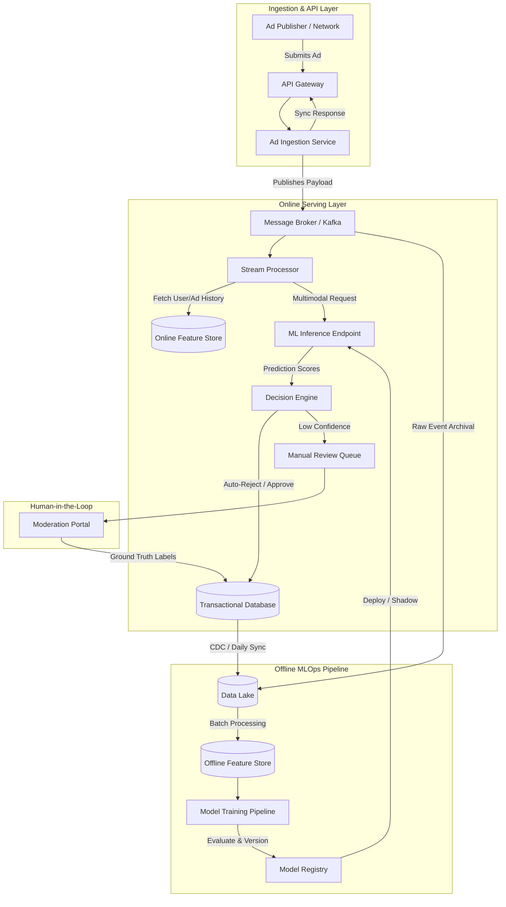

# Ad Moderation Machine Learning Platform

## 1. Architecture Overview

This proposed solution is a cloud-agnostic, event-driven microservices architecture designed to detect and moderate forbidden advertisements (e.g. illegal goods, restricted content, scams) at scale. It utilizes a multimodal machine learning approach, analyzing text, image, and metadata, to score ads in near real-time. 

To maintain high availability and accommodate traffic spikes without impacting the user experience, the system separates synchronous ingestion from heavy asynchronous ML inference via a message broker. Ads are processed by a stream processing engine that interacts with an online feature store for low-latency context retrieval. A moderation decision engine applies business rules and ML scores to automatically approve, reject, or route borderline cases to a human review portal. An offline MLOps pipeline continuously captures ground truth data from human reviewers to retrain and deploy updated models, mitigating adversarial adaptation and model drift over time.

## 2. Architecture Diagram

## 3. Well-Architected Framework Analysis

* **Operational Excellence:** MLOps practices are strictly enforced. Infrastructure as Code (IaC) is used for provisioning. The Model Registry versions all models, allowing for easy rollbacks, tracking of hyperparameters, and auditing. Shadow model deployments are utilized so new iterations can be tested on live traffic, validating precision and recall, without affecting actual moderation decisions.
* **Security:** All API endpoints sit behind an API Gateway configured with rate limiting, WAF, and strong authentication (e.g. OAuth2). Data containing Personally Identifiable Information (PII) is masked before landing in the Data Lake. Strict Role-Based Access Control (RBAC) ensures human reviewers only see the minimum data necessary to make moderation decisions.
* **Reliability:** The event-driven architecture heavily utilizes a message broker as a resilient buffer. If the heavy ML Inference layer scales down or becomes temporarily degraded, ad ingestion is not blocked; events safely queue up. Multi-zone and multi-region deployments ensure the platform can survive isolated datacenter outages. 
* **Performance Efficiency:** We aggressively separate online and offline compute. The online stream processing uses an in-memory Online Feature Store (e.g. Redis) for sub-millisecond retrieval of historical ad behavior. The ML Inference layer utilizes GPU instances optimized with batched serving frameworks to maximize throughput while strictly adhering to latency Service Level Agreements (SLAs).
* **Cost Optimization:** Auto-scaling policies for the inference tier are bound to queue depth rather than generic CPU utilization, scaling out expensive GPU instances only when the backlog grows. Batch ML training jobs are executed on spot/preemptible instances to drastically reduce offline compute costs. Strict data lifecycle policies transition cold data from the Data Lake to cheaper, archival storage tiers.
* **Sustainability:** By employing model optimization techniques such as quantization and pruning, the system reduces the compute overhead, memory footprint, and overall power consumption required per inference. The architecture avoids running idle heavy-compute instances by leveraging elastic scale-to-zero capabilities for non-peak hours and utilizing efficient data serialization formats (like Parquet) to reduce storage and network transfer energy.

## 4. Technical Glossary

* **CDC (Change Data Capture):** A set of software design patterns used to determine and track data that has changed in a database so action can be taken across downstream systems (like syncing a Data Lake).
* **Data Drift:** The change in model input data distribution over time, which can cause the model's predictive performance to degrade. In ad moderation, this often happens when bad actors change their keywords or tactics to bypass filters.
* **Feature Store:** A centralized system for organizing, storing, and serving machine learning features. It consists of an "Online" store for low-latency real-time serving and an "Offline" store for bulk historical training data.
* **Message Broker (e.g. Apache Kafka):** A distributed event streaming platform used for high-performance data pipelines, providing a durable buffer between microservices.
* **MLOps (Machine Learning Operations):** A set of engineering practices that aim to unify ML system development and operations, ensuring models are deployed and maintained reliably and efficiently in production.
* **Model Registry:** A centralized repository to manage the full lifecycle of ML models, tracking metadata such as versioning, stage transitions, data lineage, and performance metrics.
* **Multimodal Machine Learning:** An ML architecture capable of processing and relating information from multiple distinct data types simultaneously—in this case, analyzing the text (ad copy), visual data (ad image/video), and tabular data (advertiser history) within a single predictive pass.
* **Quantization:** A model optimization technique that reduces the mathematical precision of the numbers used to represent a neural network's parameters, shrinking the model size and speeding up inference with minimal loss of accuracy. 
* **Shadow Deployment:** A safe deployment strategy where a new model receives a copy of real-time production traffic, but its predictions are logged rather than acted upon, allowing engineers to evaluate its real-world performance safely.
