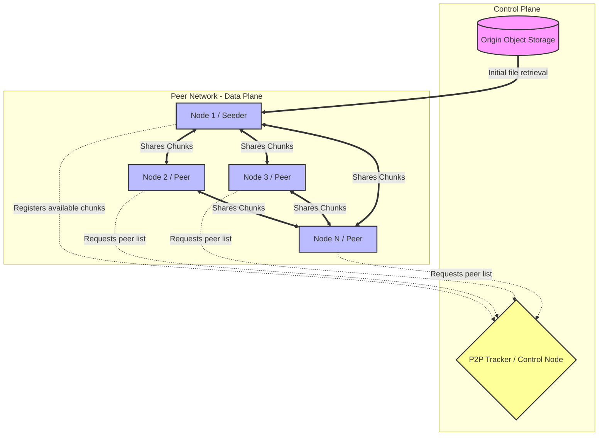

# High-Scale Peer-to-Peer Large File Distribution

## 1. Architecture Overview

To distribute a massive file, such as LLM weights, to thousands of machines over a constrained network link, the traditional hub-and-spoke pattern (where every machine downloads directly from a central file server or object store) is fundamentally flawed. It will rapidly saturate the central network uplink, causing severe degradation, timeouts, and an exponentially increasing deployment time. 

The proposed solution utilizes a **Peer-to-Peer (P2P) Distribution Architecture**, heavily inspired by protocols like BitTorrent and enterprise implementations like Uber's Kraken or Alibaba's Dragonfly. Instead of downloading the entire file from the origin, the file is split into small, cryptographically verified chunks. A small number of initial nodes (or a dedicated seeder) download these chunks. As soon as a node receives a chunk, it immediately becomes a temporary server (seeder) for that specific chunk to other nodes in the network. A central "Tracker" manages the metadata, directing nodes to peers that hold the chunks they need. This approach transforms a network bottleneck into an asset: the more machines participating, the faster and more resilient the distribution becomes.

## 2. Architecture Diagram

## 3. Well-Architected Framework Analysis
### Operational Excellence
* **Automated Rollouts:** The P2P client runs as a background daemon (e.g., a Kubernetes DaemonSet) on all target machines. File distribution is triggered via an orchestrator (like Ansible or a CI/CD pipeline) updating the required hash in a central configuration.
* **Observability:** The Tracker acts as a central telemetry hub, providing real-time metrics on network saturation, chunk distribution percentages, and individual node completion status. Alerts can be configured for orphaned nodes or stalled downloads.

### Security
* **Data Integrity:** The massive file is broken into smaller chunks, each hashed using SHA-256. A manifest of these hashes is distributed first. As peers receive chunks from unknown neighboring nodes, they verify the hash before writing to disk, entirely eliminating the risk of corrupted or maliciously altered data.
* **Network Security:** All inter-node communications (P2P data plane) and Tracker communications (control plane) occur over mTLS (Mutual TLS). This ensures that only authenticated nodes within the corporate boundary can join the swarm.

### Reliability
* **Decentralization and Fault Tolerance:** If the Origin Storage goes offline after the initial seed, the deployment continues uninterrupted because the swarm collectively holds the file. If individual nodes crash during download, peer nodes simply request the missing chunks from other healthy peers.
* **Tracker High Availability:** The Tracker is deployed behind a load balancer in a multi-instance configuration, backed by a highly available in-memory data store (like Redis) to ensure no single point of failure in the control plane.

### Performance Efficiency
* **Sub-linear Scaling:** Unlike centralized downloads, download times do not degrade linearly with the addition of new nodes. Aggregate network bandwidth increases organically as the swarm grows.
* **Topology-Aware Distribution:** The Tracker is configured to be aware of the physical network topology (e.g., racks, availability zones). It prioritizes peer-matching within the same Top-of-Rack (ToR) switch before traversing the constrained core network links, drastically reducing cross-link saturation.

### Cost Optimization
* **Egress Reduction:** By utilizing the dormant East-West network bandwidth between compute nodes, this architecture drastically reduces the egress bandwidth costs and IOPS overhead associated with centralized Object Storage or NAS appliances.
* **Hardware Lifecycle:** Prevents the need to purchase expensive, high-throughput network appliances just to handle burst deployments of machine learning models.

### Sustainability
* **Energy Efficiency:** By completing the distribution across thousands of machines in a fraction of the time, the total active compute duration required for a deployment window is minimized.
* **Resource Optimization:** Maximizes the utilization of existing network infrastructure rather than requiring additional, dedicated hardware deployments to solve a burst-throughput problem.

## 4. Technical Glossary
* **BitTorrent Protocol:** A communication protocol for peer-to-peer file sharing which enables users to distribute data and electronic files over the Internet in a decentralized manner.
* **Peer-to-Peer (P2P) Architecture:** A distributed application architecture that partitions tasks or workloads between peers. Peers are equally privileged, equipotent participants in the application.
* **Tracker:** A centralized service in a P2P network that keeps track of which peers have which files (or chunks of files) and assists nodes in discovering each other.
* **Seeder:** A node in the P2P network that has the complete file (or 100% of the required chunks) and is actively uploading it to other peers.
* **Leecher (Peer):** A node that is actively downloading the file. In modern P2P, a leecher also simultaneously uploads the chunks it has already downloaded to other leechers.
* **Chunking:** The process of dividing a large file into smaller, equally sized pieces. This allows multiple pieces to be downloaded concurrently from different sources.
* **SHA-256 Hash:** A cryptographic hash function that outputs a 256-bit signature representing a piece of data. Used here to verify that a downloaded chunk perfectly matches the original data.
* **mTLS (Mutual TLS):** A security practice where both the client and the server cryptographically verify each other's identities using digital certificates before establishing a connection.
* **East-West Traffic:** Network traffic that flows laterally within a data center or network (e.g., server to server), as opposed to North-South traffic which enters or exits the network.
* **Topology-Awareness:** The ability of a distributed system to understand the physical or logical layout of the underlying network, allowing it to optimize communication by keeping data transfers localized to a specific physical area (like a single server rack).
