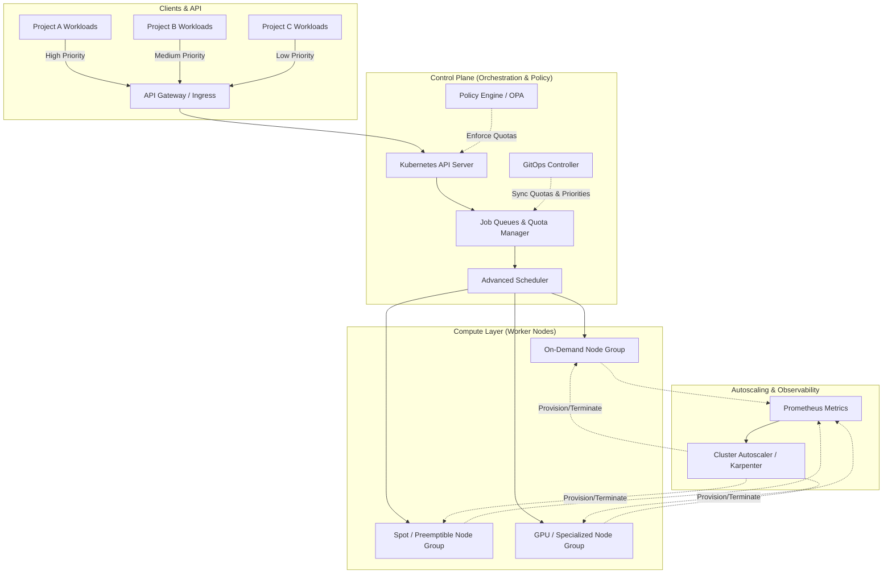

# Distributed Compute Resource Allocation Architecture

## 1. Architecture Overview

This architecture provides a scalable, cloud-agnostic solution for dynamically prioritizing and allocating distributed compute resources across multiple concurrent projects. Leveraging a container orchestration platform (Kubernetes) augmented by an advanced batch scheduling and queueing system (such as Kueue or Apache YuniKorn), the system ensures multi-tenant fairness, strict quota management, and hierarchical workload prioritization. It intelligently scales underlying infrastructure in real-time, utilizing automated bin-packing and preemptible compute nodes to maximize throughput while preventing resource starvation for high-priority initiatives.

## 2. Architecture Diagram

## 3. Well-Architected Framework Analysis

### Operational Excellence
* **Infrastructure as Code (IaC) & GitOps:** All resource quotas, project priorities, and queue configurations are maintained in version control systems and deployed via GitOps controllers (e.g., ArgoCD, Flux). This ensures auditable, repeatable, and easily reversible configuration changes.
* **Comprehensive Observability:** Centralized logging and metrics (Prometheus/Grafana) track queue depths, wait times, eviction rates, and node utilization, allowing operators to proactively tune scheduler weights and debug bottlenecks.

### Security
* **Tenant Isolation:** Each project is assigned a dedicated namespace with strict Role-Based Access Control (RBAC). Network policies isolate intra-project communication where necessary.
* **Admission Control:** A Policy Engine (e.g., Open Policy Agent/Gatekeeper) intercepts job submissions to ensure they contain required metadata (e.g., cost-center tags) and do not exceed predefined project boundaries or request unauthorized privileged access.

### Reliability
* **High-Availability Control Plane:** The orchestration control plane is distributed across multiple Availability Zones to prevent single points of failure.
* **Graceful Eviction and Checkpointing:** If higher-priority jobs preempt lower-priority ones, workloads are gracefully terminated. Where applicable, jobs utilize checkpointing to resume from the last saved state rather than restarting entirely.

### Performance Efficiency
* **Advanced Scheduling & Bin-packing:** The scheduler continuously evaluates pending queues, optimizing the placement of containers onto compute nodes (bin-packing) to minimize fragmented, unused CPU/Memory overhead.
* **Just-In-Time Provisioning:** Node autoscalers (like Karpenter) bypass rigid autoscaling groups to directly provision right-sized compute instances based specifically on the pending pod's resource requests, reducing launch latency.

### Cost Optimization
* **Resource Bursting & Quota Sharing:** Projects are guaranteed a baseline compute quota but can "burst" and borrow unused capacity from other idle projects, maximizing overall cluster utilization.
* **Spot/Preemptible Compute Integration:** Low-priority, fault-tolerant workloads are automatically routed to Spot/preemptible instances, significantly reducing compute costs for non-time-sensitive batch processing.
* **Scale-to-Zero:** The autoscaler aggressively scales down idle nodes to zero during periods of low demand to eliminate wasted spend.

### Sustainability
* **Maximized Hardware Utilization:** Efficient bin-packing algorithms ensure that active servers run at optimal utilization rates (e.g., 70-80%), reducing the aggregate energy consumption compared to running multiple under-utilized clusters.
* **Dynamic Footprint:** By aggressively terminating idle instances and shifting flexible workloads to off-peak hours (time-shifting), the architecture minimizes its carbon footprint and hardware lifecycle impact.

## 4. Technical Glossary

* **Bin-packing:** An optimization algorithm used by schedulers to pack as many containers onto a single host as possible without causing resource exhaustion, minimizing wasted idle space.
* **Cluster Autoscaler / Karpenter:** Tools that automatically adjust the size of a Kubernetes cluster by adding or removing compute nodes based on the resource requirements of pending jobs.
* **GitOps:** A set of practices that uses Git repositories as the single source of truth to deliver infrastructure as code and applications.
* **Kubernetes (K8s):** An open-source container orchestration platform that automates the deployment, scaling, and management of containerized applications.
* **Namespace:** A Kubernetes mechanism to partition resources into logically named groups, providing a scope for names and security policies.
* **Open Policy Agent (OPA):** A general-purpose policy engine that unifies policy enforcement across the stack, often used to validate or mutate resource requests before they are scheduled.
* **Preemptible / Spot Instances:** Unused compute capacity offered by cloud providers at a steep discount, with the caveat that they can be reclaimed (preempted) by the provider at any time with minimal warning.
* **Queue / Batch Scheduler (e.g., Kueue, YuniKorn):** Extensions to standard orchestration platforms designed specifically to handle batch processing, managing job queues, relative priorities, fairness, and complex quota constraints.
* **RBAC (Role-Based Access Control):** A method of restricting network or system access based on the roles of individual users within an enterprise.
